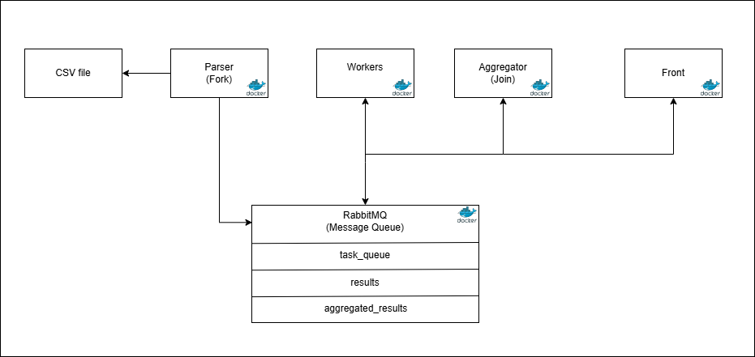

# Programmation Parallèle

Ce projet illustre un traitement de données réparti sur plusieurs conteneurs Docker en utilisant RabbitMQ comme système de messagerie. Le but est d’analyser un fichier de transactions automobiles afin de calculer divers indicateurs par ville.

## Architecture distribuée



L’architecture suit un modèle Fork–Join :

1. **Parser** : lit le fichier CSV, le découpe en batchs et publie ces tâches dans la file `task_queue`.
2. **Workers** : plusieurs conteneurs indépendants consomment les tâches et calculent pour chaque batch:
   - le chiffre d’affaires mensuel par ville,
   - la répartition vente/location,
   - les modèles de voiture les plus fréquents.
   Les résultats sont envoyés dans la file `results`.
3. **Aggregator** : récupère tous les résultats, fusionne les données et publie le résultat global dans `aggregated_results`.
4. **Front** : une application Flask qui expose des endpoints HTTP permettant de récupérer les résultats agrégés.
5. **RabbitMQ** : assure la communication entre toutes les étapes.

## Guide d’installation

Prérequis :
- Docker et docker-compose

Lancer la pile complète :

```bash
docker-compose up --build
```

Les services démarrent automatiquement : RabbitMQ, parser, plusieurs workers, l’agrégateur et l’interface front.  
Les données d’entrée sont lues depuis `./data/transactions_autoconnect.csv`.

Pour arrêter tous les conteneurs :

```bash
docker-compose down
```

## Guide d’utilisation

Une fois la pile démarrée, le parser lit le fichier CSV puis distribue les lots aux workers.  
Quand l’agrégateur a reçu tous les batchs, les résultats consolidés sont disponibles via l’API Flask du service `front` :

- `GET /ca_mensuel_ville` – chiffre d’affaires mensuel pour chaque ville
- `GET /repartition_vente_location` – répartition du nombre de ventes et de locations
- `GET /top_models` – modèles de voitures les plus populaires
- `GET /pourcentage_vente_location` – pourcentages vente vs location

Exemple :

```bash
curl http://localhost:5000/ca_mensuel_ville
```

## Analyse des performances

- **Temps d’exécution** : dépend essentiellement du nombre de workers. Sur un jeu de données de taille modeste, le traitement complet s’effectue en quelques secondes.  
- **Scalabilité** : l’architecture Fork–Join facilite l’ajout ou la suppression de workers. Il suffit de créer de nouveaux conteneurs `worker` dans `docker-compose.yml` pour augmenter la capacité de calcul.

Pour réaliser des mesures précises, on peut instrumenter le parser et l’agrégateur afin de chronométrer l’émission des batchs et la réception finale des résultats.

## Rapport d’analyse

### Comparaison des modèles de parallélisme testés

Nous avons choisi un modèle **Fork–Join** :
- le **fork** est réalisé par le parser qui découpe et distribue les données,
- le **join** est assuré par l’agrégateur.

Une approche MapReduce classique aurait nécessité une phase de réduction plus complexe et des outils spécifiques (par exemple Hadoop). Le fork–join s’adapte mieux à un jeu de données contenu et à un orchestrateur comme Docker Compose.

### Justification des choix techniques

- **RabbitMQ** pour garantir une file de messages fiable et persistante.
- **Python** et **pandas** pour la simplicité de manipulation des données CSV.
- **Docker** afin d’isoler chaque composant et de reproduire facilement l’environnement.

### Perspectives d’amélioration

- Automatiser la montée/descente du nombre de workers en fonction de la charge.
- Étendre l’analyse des données (statistiques supplémentaires, visualisation).
- Remplacer le fichier CSV par une source de données temps réel.
- Ajouter des tests unitaires automatisés pour chaque composant.

